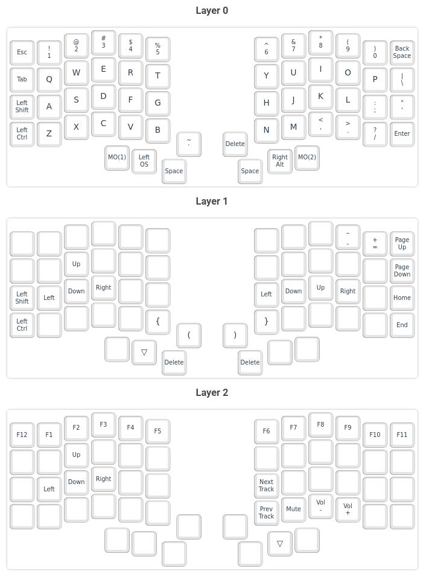

# Keebio Iris Split Keyboard Layout (QMK Key Mapping)

QMK Config files for the Iris Rev 4 split keyboard from keebio.

## About

Mechanical keyboard built with keebio Iris PCB. I write code and use vim a lot, this mapping will be geared towards my specific needs.

## Notes
The JSON file is to be used on the [QMK Configurator](https://config.qmk.fm/#/keebio/iris/rev2/LAYOUT) to have a quick visual on the key mappings and easily print out reference sheets for the layers. 

Some useful resources:
- [QMK Configurator](https://config.qmk.fm/#/keebio/iris/rev2/LAYOUT) (for generating custom JSON layout files)
- [Keebio Iris Build Guide](https://docs.keeb.io/iris-rev3-build-guide)
- [QMK documentation](https://docs.qmk.fm/#/newbs) (to build the layout and flash the hardware)

## Layout

